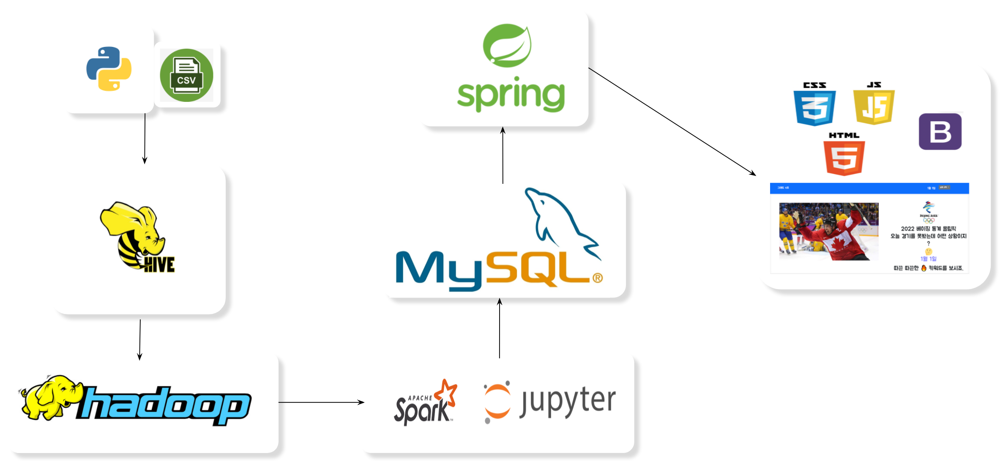
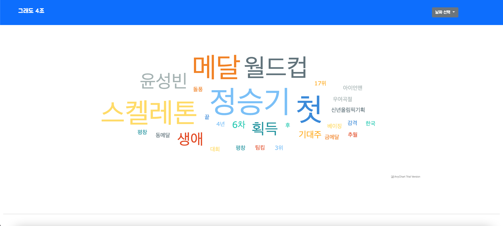

# 4조 그래도(그래 내일을 위해 도전하는거야!) - Hadoop_Spark 프로젝트

## 프로젝트 주제 : 베이징 올림픽 뉴스 기사에 따른 이슈가 되고 있는 키워드 제공

### **조원 : 이현민, 정준영, 김범석,박민규**

- 역할
    - 이현민(조장) : 데이터 수집 및 데이터 파이프라인 구축
    - 박민규(조원) : 데이터 정의 및 데이터 파이프라인 구축
    - 정준영(조원) :  백엔드
    - 김범석(조원) :  프론트엔드
- 프로젝트 목표
    - raw_data(csv) → python으로 명사 추출 → Hive → Hadoop → Spark(WordCount) → MySQL → Spring → Web
- 프로젝트 구상
    1. 미니 프로젝트 중 동계올림픽 진행.
    2. 매일 경기를 볼 수 없음.
    3. 경기 결과만 알고 내용은 잘 모름.
    4. 모든 뉴스를 보고 경기 내용을 예측 하기 어려움.
    5. 매일 기사에서 쏟아지는 단어들을 워드 클라우드로 나타내고 싶음.
- 기획
    1. 기술스택 자료조사
    2. 필요한 데이터 조사
    3. 웹페이지 기획
    4. 기획에 맞는 상용페이지 조사
    5. ui/ux 디자인
- 프로젝트 설계
    1. 메인 디자인 시안 발표
    2. 웹 스토리 보드
    3. DB 설계
    4. 수집 아키텍처 정의
- Data Flow
    
    
    
- 기능 구현 및 개발
    1. 웹 페이지 퍼블리싱,상태 관리
    2. 뉴스 기사 크롤링
    3. 데이터 전처리
    4. 데이터마트(Mysql) 저장
    5. Mysql 데이터 Web과 연동
    6. Web에 DB 데이터 게시
- 테스트 및 문서 준비
    1. QA테스트
    2. PPT 발표 자료 준비
    3. 영상 자료 준비
- 아쉬운점
    1. Sqoop을 사용하려고 했지만 Sqoop으로 데이터 이동시 한글 깨짐 현상으로 Sqoop 사용 배제
    2. Airflow,Crontab 등을 이용해 Scheduling을 하여 자동적으로 Data crawling과 Data Processing을 진행하려 했지만 올림픽이 먼저 끝나버려 Scheduling 적용을 할 수 없었던 점
    3. 설계 당시 기획은 반응형 Web을 제작하는 것이였지만 몇몇 부분에 있어서 Web 디자인적 문제로 해당 부분들은 고정된 Size로 제작
    4. Spring에서 DB 데이터를 한번에 불러와서 처리를 하는 구조가 아니라 잦은 접속을 통해 데이터를 불러오는 구조를 취하고 있어서 여러명의 유저가 동시 접속시 Web 사이트의 성능적 문제가 의심
- 구현
    

    
    
        
    

    
- git repository 구성
	- Data : Raw_data
	- main.py : 네이버 베이징 올림픽 뉴스 기사 크롤링 코드
	- konlp.py : 서버 메모리 이슈로 인해 로컬에서 실행한 명사 추출 코드
	- Project.ipynb : Spark를 이용한 명사 WordCloud 및 MYSQL EXPORT
	- Image : Markdown 이미지
